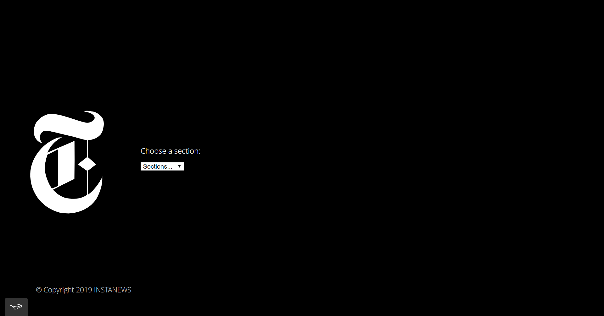
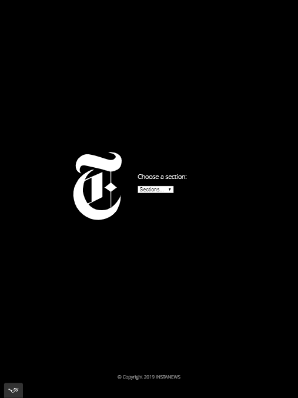
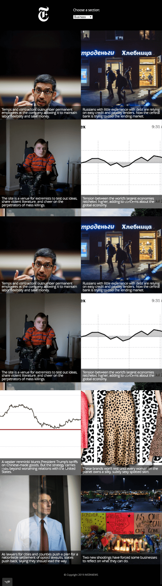

# Instanews App project

This is a One-page responsive website that allows a user to filter top news story categories via the New York Times API.
Optimize for 3 widths: mobile, min-width: 420px and min-width: 1000px

### Desktop Preview



### Tablet Preview



### Mobile Preview


# Technologies Used

* HTML
* CSS (Flexbox)
* JavaScript
* Jquery 
* SCSS (@mixins, variables, fonts, reset, etc.)
* Ajax(Json)
* Gulp (runing task such as watch, browser-syn and sass)
* tota11y (for accessibility)
* Git & Github

# Learnings


### Sass
Sass is a preprocessor scripting language that is interpreted or compiled into Cascading Style Sheets (CSS). SassScript is the scripting language itself.

Sass has some cool features compared to plain vanilla CSS:

- Nested rules
- Variables
- JS-style comments
- Mixins
- Operations
- Functions

##### In SCSS style

```
$primary-color: #3bbfce;
$margin: 16px;

.content-navigation {
  border-color: $primary-color;
  color: darken($primary-color, 10%);
}

.border {
  padding: $margin / 2;
  margin: $margin / 2;
  border-color: $primary-color;
}

```

##### Would compile to:

```
.content-navigation {
  border-color: #3bbfce;
  color: #2b9eab;
}

.border {
  padding: 8px;
  margin: 8px;
  border-color: #3bbfce;
}

```

##### Nesting SCSS style

```
table.hl {
  margin: 2em 0;
  td.ln {
    text-align: right;
  }
}

li {
  font: {
    family: serif;
    weight: bold;
    size: 1.3em;
  }
}

```

##### Would compile to:

```
table.hl {
  margin: 2em 0;
}
table.hl td.ln {
  text-align: right;
}

li {
  font-family: serif;
  font-weight: bold;
  font-size: 1.3em;
}

```

##### Mixins

```
table.hl {
  margin: 2em 0;
}
table.hl td.ln {
  text-align: right;
}

li {
  font-family: serif;
  font-weight: bold;
  font-size: 1.3em;
}

```

##### Would compile to:
```
#data th {
  text-align: center;
  font-weight: bold;
}
#data td, #data th {
  padding: 2px;
}

```

##### Smarter Media Querries

```
li {
   flex: 0 1 100%;
   @include desktop {
      flex: 0 1 50%;
   }
}

```

##### Would compile to:

```
li {
  flex: 0 1 100%;
}
@media (min-width: 1000px) {
  li {
    flex: 0 1 50%;
  }
}

```

### Ajax

Ajax provides a way to exchange data between the browser and the server without reloading the page.

Ajax is often used when submitting web forms and fetching data from a server, including from third-party APIs.

It's asynchronous because Ajax doesn’t block other events from happening when the request is sent and the client is waiting for a response.

Methods for making Ajax requests:

- .ajax()
- .load()
- .get()
- .post()
- .getJSON()
- .getScript()

Methods for dealing with Ajax responses:

- .done()
- .fail()
- .always()
- .abort()

##### Basic Ajax Request

```
<button>Get Login Name</button>
<p class="user-name"></p>

```

```
$('button').on('click', function() {
   $.ajax({
      method: 'GET',
      url: 'https://api.github.com/users/octocat'
   })
   .done(function(data) {
      $('.user-name').append(data.login);
   });
});

```

### Json

JSON stands for JavaScript Object Notation and simply provides a way for us to encode text-based data in a way that's easy to work with.

Ultimately, it gives us a way to encode both simple and more complex data structures (including strings, numbers, booleans, arrays, objects, and null) into a format that can easily be transmitted between two points.

### Gulp

gulp is an open-source JavaScript toolkit created by Eric Schoffstall[3] used as a streaming build system in front-end web development.

It is a task runner built on Node.js and npm, used for automation of time-consuming and repetitive tasks involved in web development like minification, concatenation, cache busting,unit testing, linting, optimization, etc.

```
npm install --save-dev gulp-terser gulp-rename
```
```

const gulp = require("gulp"); // Load Gulp!
// Now that we've installed the terser package we can require it:
const terser = require("gulp-terser"),
  rename = require("gulp-rename");
gulp.task("default", function() {
  return gulp
    .src("./js/*.js") // What files do we want gulp to consume?
    .pipe(terser()) // Call the terser function on these files
    .pipe(rename({ extname: ".min.js" })) // Rename the uglified file
    .pipe(gulp.dest("./build/js")); // Where do we put the result?
});

```

### Accessibility

At a high level, you can think of accessibility on the web as making sure that all of your users can access all of the content and essential functionality on your website.

Web accessibility is the inclusive practice of ensuring there are no barriers that prevent interaction with, or access to, websites on the World Wide Web by people with disabilities. When sites are correctly designed, developed and edited, generally all users have equal access to information and functionality.